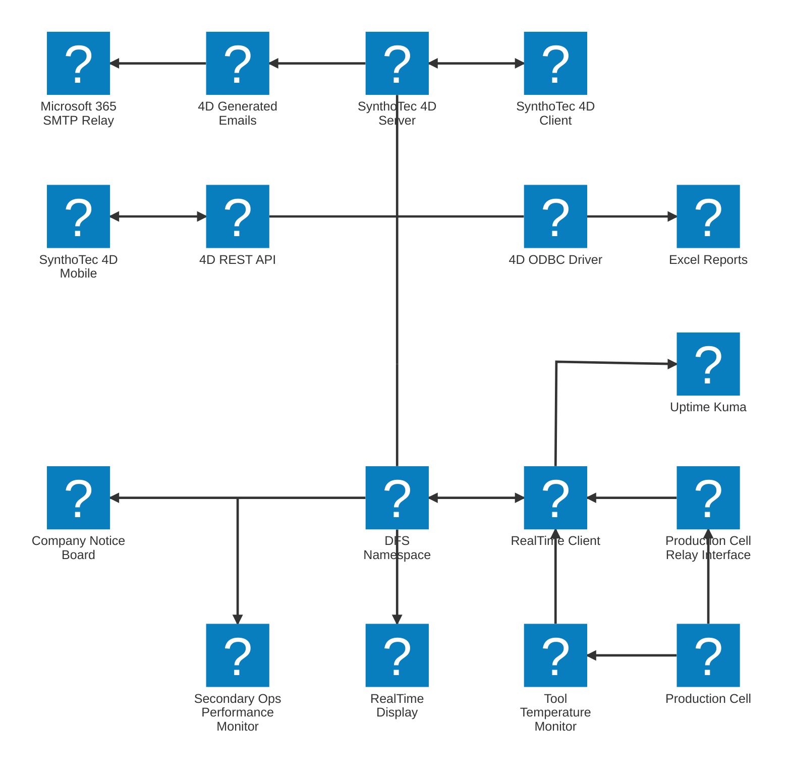

# System Architecture

```mermaid
architecture-beta
    service 4d_server(simple-icons:4d)[SynthoTec 4D Server]
    service rest_api(streamline-ultimate-color:earth-refresh)[4D REST API]
    service odbc_driver(streamline-ultimate-color:database-share-1)[4D ODBC Driver]
    service dfs_namespace(streamline-ultimate-color:folder-share)[DFS Namespace]
    service excel_reports(vscode-icons:file-type-excel2)[Excel Reports]
    service 4d_mobile(devicon:xamarin)[SynthoTec 4D Mobile]
    service 4d_client(file-icons:4d)[SynthoTec 4D Client]
    service realtime_client(devicon:visualbasic)[RealTime Client]
    service realtime_display(devicon:visualbasic)[RealTime Display]
    service tool_temp_monitor(devicon:arduino-wordmark)[Tool Temperature Monitor]
    service production_cell(streamline-ultimate:factory-industrial-robot-arm-1-bold)[Production Cell]
    service companyNoticeBoard(devicon:visualbasic)[Company Notice Board]
    service secondaryOpsPerformance(devicon:visualbasic)[Secondary Ops Performance Monitor]
    service microsoft_smtp_relay(logos:microsoft-icon)[Microsoft 365 SMTP Relay]
    service 4d_emails(streamline-ultimate-color:email-action-add)[4D Generated Emails]
    service production_cell_relay_interface(mdi:serial-port)[Production Cell Relay Interface]
    service uptime_kuma(simple-icons:uptimekuma)[Uptime Kuma]

    junction junctionTop
    junction junctionBottom
    junction junctionRight
    junction junctionRT
    junction junctionFileshare

    4d_server:B -- T:junctionTop
    4d_server:R <--> L:4d_client
    junctionTop:B -- T:junctionBottom
    junctionBottom:B -- T:dfs_namespace
    dfs_namespace:R <--> L:realtime_client
    realtime_client:B <-- T:tool_temp_monitor
    realtime_client:R <-- L:production_cell_relay_interface
     production_cell_relay_interface:B <-- T:production_cell
    tool_temp_monitor:R <-- L:production_cell
    dfs_namespace:B --> T:realtime_display
    junctionTop:R -- L:odbc_driver
    odbc_driver:R --> L:excel_reports
    junctionTop:L -- R:rest_api
    rest_api:L <--> R:4d_mobile
    dfs_namespace:L -- R:junctionFileshare
    junctionFileshare:L --> R:companyNoticeBoard
    junctionFileshare:B --> T:secondaryOpsPerformance
    4d_server:L --> R:4d_emails
    4d_emails:L --> R:microsoft_smtp_relay
    realtime_client:T --> L:uptime_kuma
```

