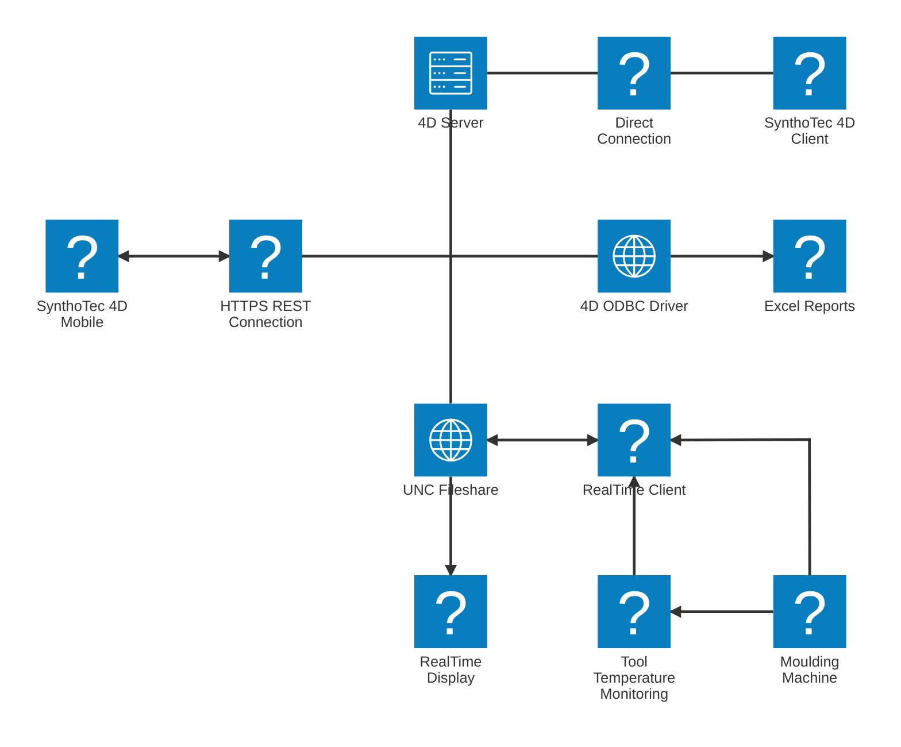

# System Architecture

```mermaid
architecture-beta
    service SERVER(server)[4D Server]
    service DIRECT(icon-park-outline:excel)[Direct Connection]
    service HTTPS(file-icons:4d)[HTTPS REST Connection]
    service ODBC(internet)[4D ODBC Driver]
    service UNC(internet)[UNC Fileshare]
    service EXCEL(vscode-icons:file-type-excel)[Excel Reports]
    service MOBILE(logos:xamarin)[SynthoTec 4D Mobile]
    service CLIENT(logos:xamarin)[SynthoTec 4D Client]
    service CLIENT_RT(logos:xamarin)[RealTime Client]
    service DISPLAY_RT(logos:xa)[RealTime Display]
    service tool_temp_monitoring(logos:xamarin)[Tool Temperature Monitoring]
    service moulding_machine(logos:xamarin)[Moulding Machine]

    junction junctionTop
    junction junctionRight
    junction junctionRT

    SERVER:B -- T:junctionTop
    SERVER:R -- L:DIRECT
    DIRECT:R -- L:CLIENT
    junctionTop:B -- T:UNC
    UNC:R <--> L:CLIENT_RT
    CLIENT_RT:B <-- T:tool_temp_monitoring
    CLIENT_RT:R <-- T:moulding_machine
    tool_temp_monitoring:R <-- L:moulding_machine
    UNC:B --> T:DISPLAY_RT
    junctionTop:R -- L:ODBC
    ODBC:R --> L:EXCEL
    junctionTop:L -- R:HTTPS
    HTTPS:L <--> R:MOBILE
```