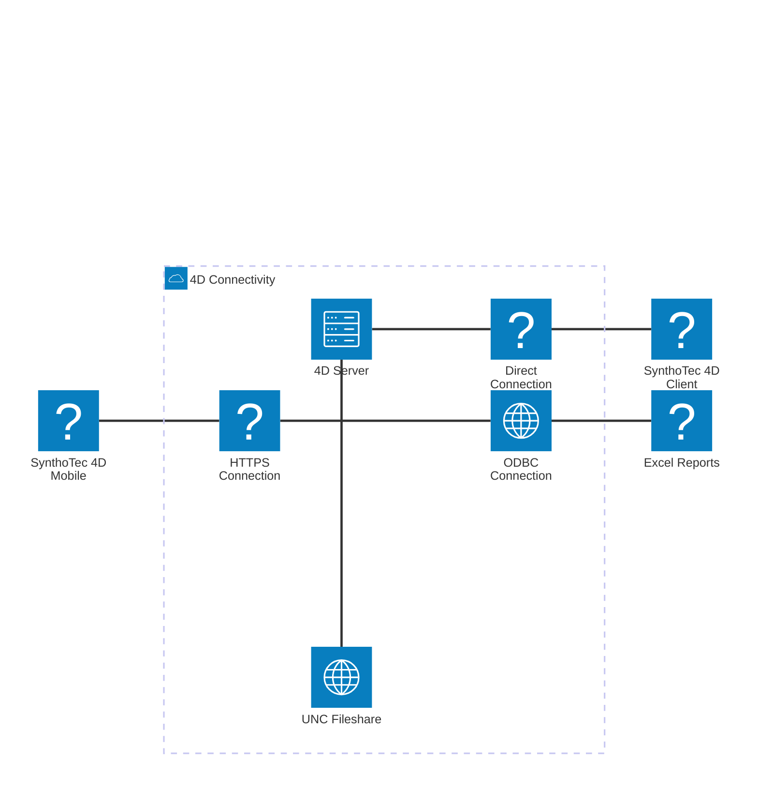

# System Architecture

```mermaid
architecture-beta
    group 4DC(cloud)[4D Connectivity]
    service SERVER(server)[4D Server] in 4DC
    service DIRECT(icon-park-outline:excel)[Direct Connection] in 4DC
    service HTTPS(file-icons:4d)[HTTPS Connection] in 4DC
    service ODBC(internet)[ODBC Connection] in 4DC
    service UNC(internet)[UNC Fileshare] in 4DC
    service EXCEL(vscode-icons:file-type-excel)[Excel Reports]
    service MOBILE(logos:xamarin)[SynthoTec 4D Mobile]
    service CLIENT(logos:xamarin)[SynthoTec 4D Client]
    junction junctionTop
    junction junctionRight

    SERVER:B -- T:junctionTop
    SERVER:R -- L:DIRECT
    DIRECT:R -- L:CLIENT
    junctionTop:B -- T:UNC
    junctionTop:R -- L:ODBC
    ODBC:R -- L:EXCEL
    junctionTop:L -- R:HTTPS
    HTTPS:L -- R:MOBILE
```