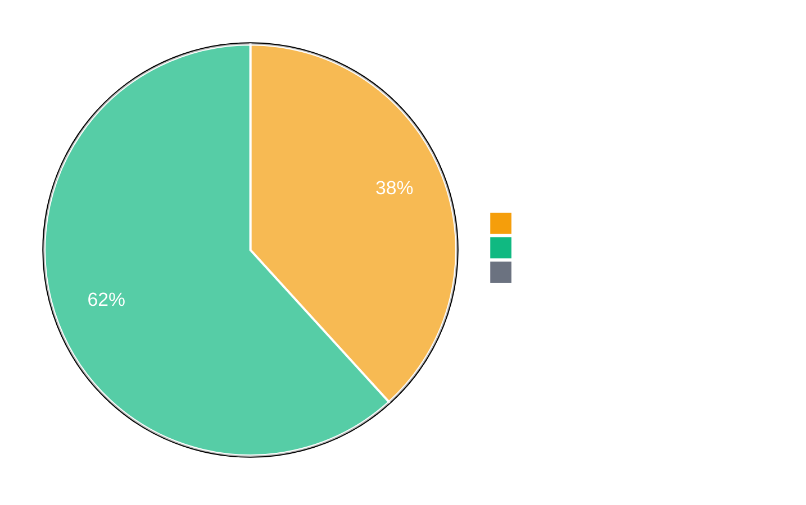

# SynthoTec-4D Documentation Overview

A comprehensive manufacturing ERP system for injection molding operations. Manages production scheduling, quality control, inventory tracking, customer orders, and real-time machine monitoring. Built with 4D v20 and includes modules for BOMs, certifications, packing instructions, and automated label generation.

## Documentation Progress

**Last Updated**: 2026-01-13T00:00:00Z2026-01-13T16:04:13.848Z

### Overall Completion Status

### Classes Documentation

Total Classes: **154**

```mermaid
%%{init: {'theme':'base', 'themeVariables': {'xyChart': {'backgroundColor': 'transparent', 'plotColorPalette': '#6b7280, #10b981'}}}}%%
xychart-beta
    title "Classes Documentation Metrics"
    x-axis ["Descriptions", "Functions", "Properties", "Examples"]
    y-axis "Count" 0 --> 723
    bar [154, 723, 183, 154]
    bar [0, 717, 183, 0]
```

### Forms Documentation

Total Forms: **156**

```mermaid
%%{init: {'theme':'base', 'themeVariables': {'xyChart': {'backgroundColor': 'transparent', 'plotColorPalette': '#6b7280, #10b981'}}}}%%
xychart-beta
    title "Forms Documentation Metrics"
    x-axis ["Descriptions", "Screenshots"]
    y-axis "Count" 0 --> 156
    bar [156, 156]
    bar [17, 1]
```

### Tables Documentation

Total Tables: **129**

```mermaid
%%{init: {'theme':'base', 'themeVariables': {'xyChart': {'backgroundColor': 'transparent', 'plotColorPalette': '#6b7280, #10b981'}}}}%%
xychart-beta
    title "Tables Documentation Metrics"
    x-axis ["Descriptions", "Fields", "N→1 Relations", "1→N Relations"]
    y-axis "Count" 0 --> 1894
    bar [129, 1894, 0, 0]
    bar [129, 66, 0, 0]
```

### Summary Statistics

| Entity Type | Total | Fully Documented | Partially Documented | Not Started | Avg Completion |
|-------------|-------|------------------|----------------------|-------------|----------------|
| Classes | 154 | 148 | 1 | 0 | 99.9% |
| Forms | 156 | 17 | 139 | 0 | 30.9% |
| Tables | 129 | 1 | 128 | 0 | 50.4% |
| **Total** | **439** | **166** | **268** | **0** | - |

