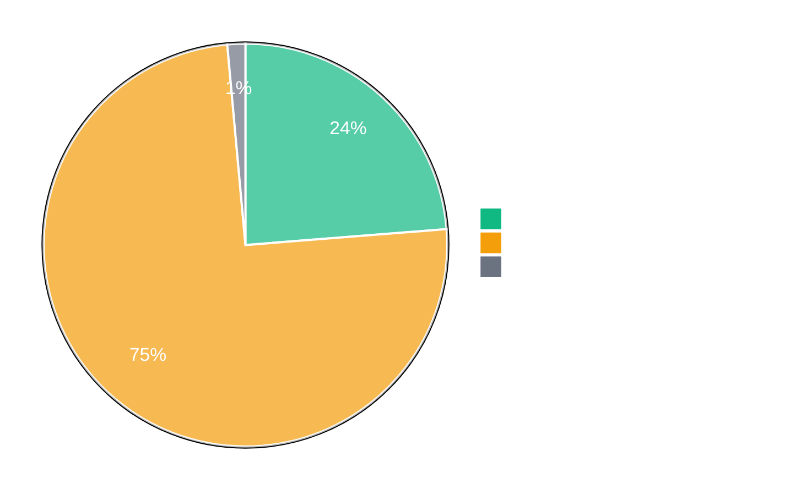

# SynthoTec-4D Documentation Overview

A comprehensive manufacturing ERP system for injection molding operations. Manages production scheduling, quality control, inventory tracking, customer orders, and real-time machine monitoring. Built with 4D v20 and includes modules for BOMs, certifications, packing instructions, and automated label generation.

## Documentation Progress

**Last Updated**: 2025-12-04T00:00:00Z2025-12-04T15:12:31.681Z

### Overall Completion Status

### Classes Documentation

Total Classes: **152**

### Forms Documentation

Total Forms: **156**

### Tables Documentation

Total Tables: **129**

### Summary Statistics

| Entity Type | Total | Fully Documented | Partially Documented | Not Started | Avg Completion |
|-------------|-------|------------------|----------------------|-------------|----------------|
| Classes | 152 | 63 | 80 | 4 | 71.9% |
| Forms | 156 | 2 | 154 | 0 | 27.1% |
| Tables | 129 | 1 | 128 | 0 | 50.4% |
| **Total** | **437** | **66** | **208** | **4** | - |

