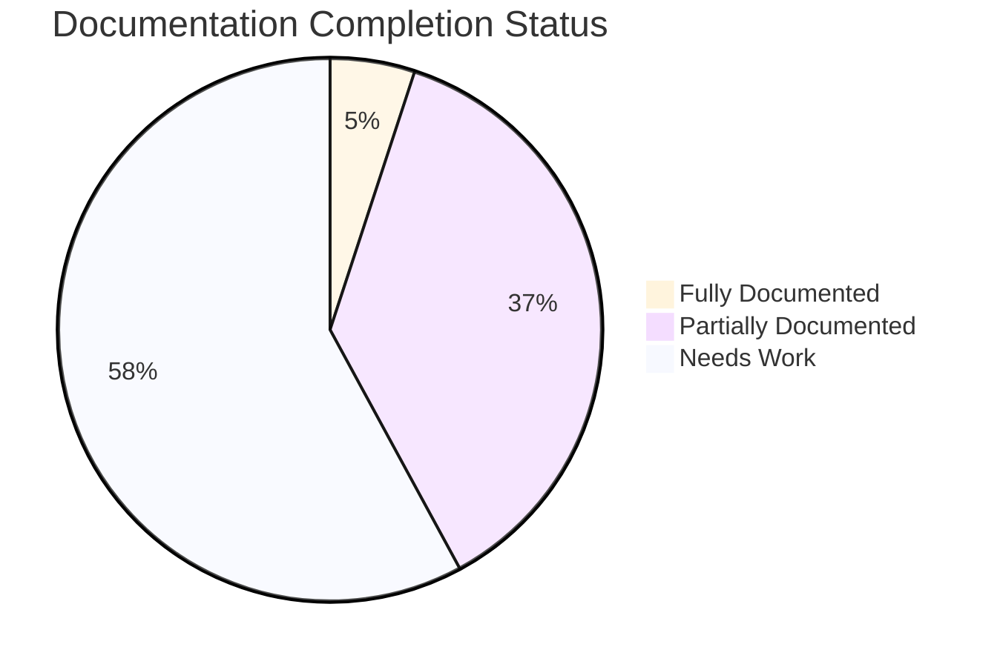

# SynthoTec-4D Documentation Overview

A comprehensive manufacturing ERP system for injection molding operations. Manages production scheduling, quality control, inventory tracking, customer orders, and real-time machine monitoring. Built with 4D v20 and includes modules for BOMs, certifications, packing instructions, and automated label generation.

## Documentation Progress

**Last Updated**: 2025-12-04T00:00:00Z2025-12-04T13:01:59.217Z

### Overall Completion Status

### Classes Documentation

Total Classes: **152**

```mermaid
%%{init: {'theme':'base', 'themeVariables': {'xyChart': {'backgroundColor': 'transparent', 'plotColorPalette': '#6b7280, #10b981'}}}}%%
xychart-beta
    title "Classes Documentation Metrics"
    x-axis ["Descriptions", "Functions", "Properties", "Examples"]
    y-axis "Count" 0 --> 721
    bar [152, 721, 179, 152]
    bar [0, 0, 0, 0]
```

### Forms Documentation

Total Forms: **156**

### Tables Documentation

Total Tables: **129**

```mermaid
%%{init: {'theme':'base', 'themeVariables': {'xyChart': {'backgroundColor': 'transparent', 'plotColorPalette': '#6b7280, #10b981'}}}}%%
xychart-beta
    title "Tables Documentation Metrics"
    x-axis ["Descriptions", "Fields", "N→1 Relations", "1→N Relations"]
    y-axis "Count" 0 --> 1894
    bar [129, 1894, 0, 0]
    bar [0, 0, 0, 0]
```

### Summary Statistics

| Entity Type | Total | Fully Documented | Partially Documented | Needs Work | Avg Completion |
|-------------|-------|------------------|----------------------|------------|----------------|
| Classes | 152 | 12 | 103 | 32 | 43.2% |
| Forms | 156 | 2 | 154 | 0 | 27.1% |
| Tables | 129 | 0 | 0 | 129 | 0% |
| **Total** | **437** | **14** | **103** | **161** | - |

### Detailed Progress Reports

- [Classes Progress Details](_progress_classes.md)
- [Forms Progress Details](_progress_forms.md)
- [Tables Progress Details](_progress_tables.md)
