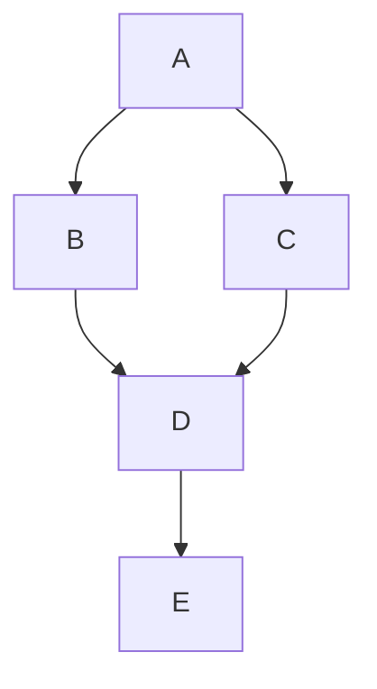
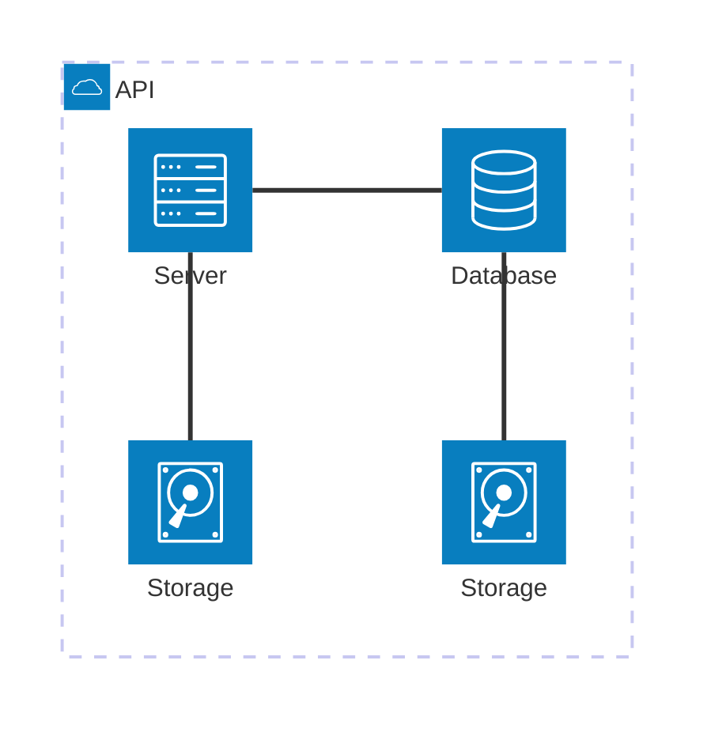

# RealTime

```mermaid
graph TD;
    accTitle: the diamond pattern
    accDescr: a graph with four nodes: A points to B and C, while B and C both point to D
    A-->B;
    A-->C;
    B-->D;
    C-->D;
    D-->E;
```

Architecture test:

```mermaid
architecture-beta
    group api(cloud)[API]

    service db(database)[Database] in api
    service disk1(disk)[Storage] in api
    service disk2(disk)[Storage] in api
    service server(server)[Server] in api

    db:L -- R:server
    disk1:T -- B:server
    disk2:T -- B:db
```