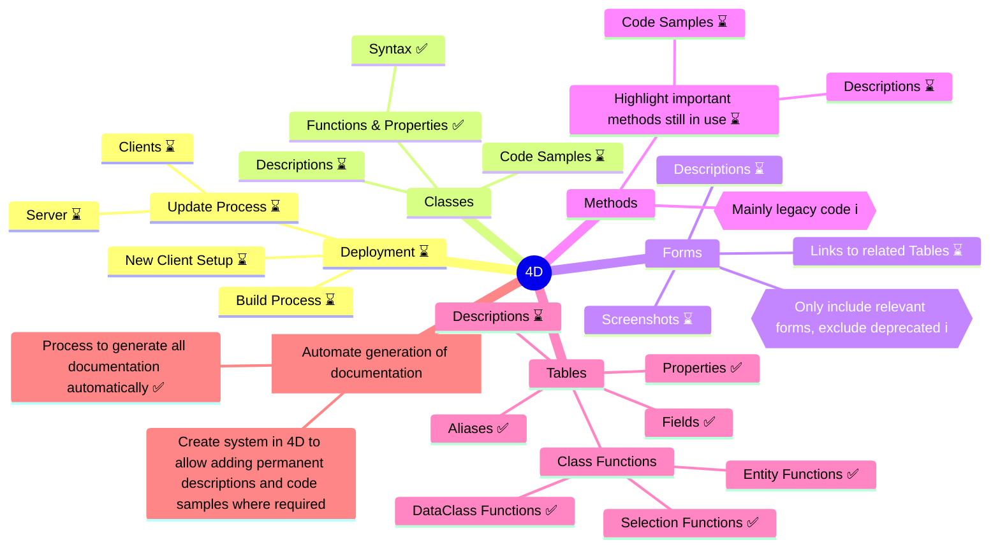
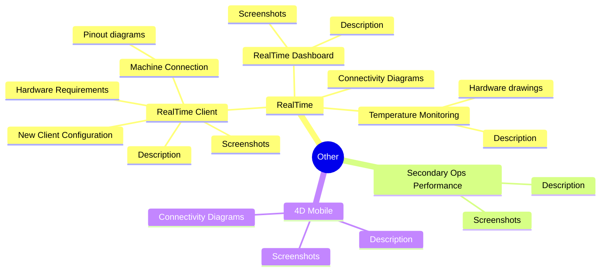

# SynthoTec Developer Documentation

## 4D Mindmap

```mermaid
mindmap
    root((4D))
        Deployment ⌛
            Build Process ⌛
            New Client Setup ⌛
            Update Process ⌛
                Clients ⌛
                Server ⌛
        Classes
            Code Samples ⌛
            Descriptions ⌛
            Functions & Properties ✅
                Syntax ✅
        Forms
            id{{Only include relevant forms, exclude deprecated ℹ️}}
            Descriptions ⌛
            Links to related Tables ⌛
            Screenshots ⌛
        Methods
            id{{Mainly legacy code ℹ️}}
            Highlight important methods still in use ⌛
                Code Samples ⌛
                Descriptions ⌛
        Tables
            Descriptions ⌛
            Fields ✅
            Aliases ✅
            Properties ✅
            Class Functions
                DataClass Functions ✅
                Entity Functions ✅
                Selection Functions ✅
        [Automate generation of documentation]
            Process to generate all documentation automatically ✅
            Create system in 4D to allow adding permanent descriptions and code samples where required
```

## Other Applications Mindmap

```mermaid
mindmap
    root((Other))
        RealTime
            RealTime Client
                Description
                Screenshots
                Hardware Requirements
                Machine Connection
                    Pinout diagrams
                New Client Configuration
            RealTime Dashboard
                Description
                Screenshots
            Temperature Monitoring
                Description
                Hardware drawings
            Connectivity Diagrams
        Secondary Ops Performance
            Description
            Screenshots
        4D Mobile
            Description
            Screenshots
            Connectivity Diagrams
```