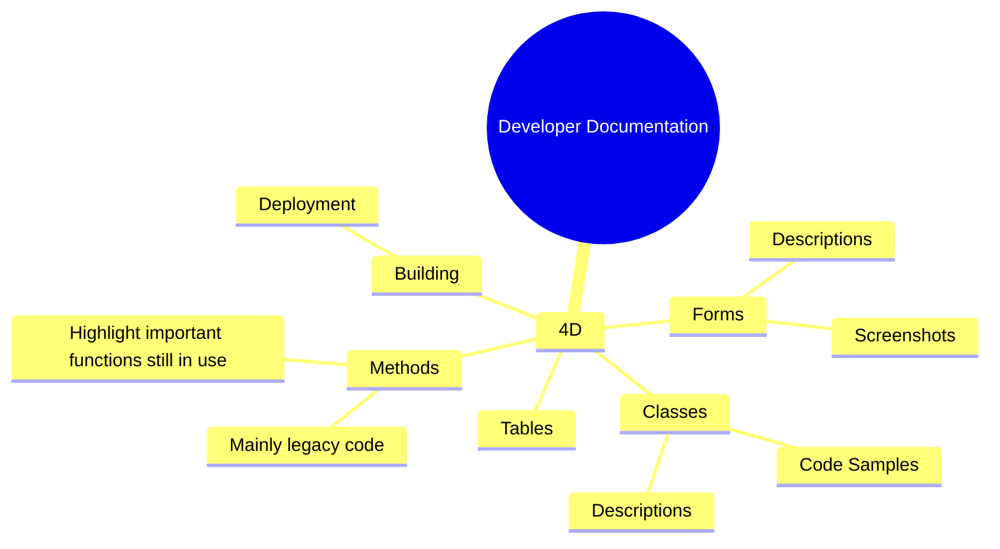

# SynthoTec Developer Documentation

## Mindmap

```mermaid
mindmap
    root((Developer Documentation))
        4D
            Building
                Deployment
            Classes
                Code Samples
                Descriptions
            Forms
                Descriptions
                Screenshots
            Methods
                Mainly legacy code
                Highlight important functions still in use
            Tables
            ::icon(fa fa-book)
            
```