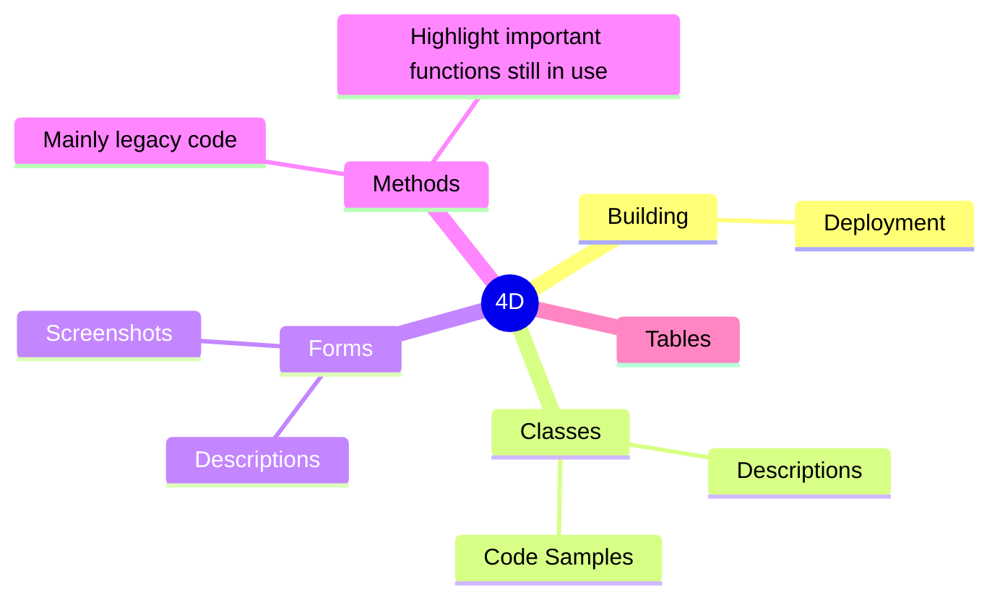

# SynthoTec Developer Documentation

## 4D Mindmap

```mermaid
mindmap
    root((4D))
        Building
            Deployment
        Classes
            Code Samples
            Descriptions
        Forms
            Descriptions
            Screenshots
        Methods
            Mainly legacy code
            Highlight important functions still in use
        Tables            
```